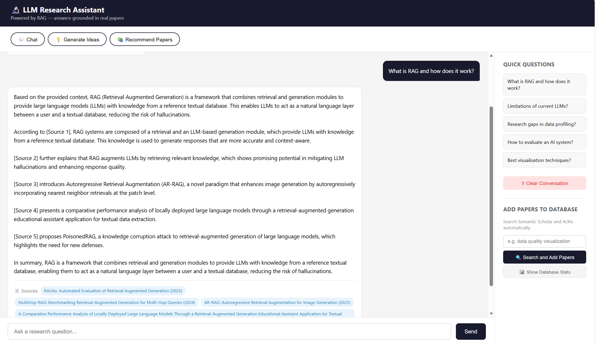
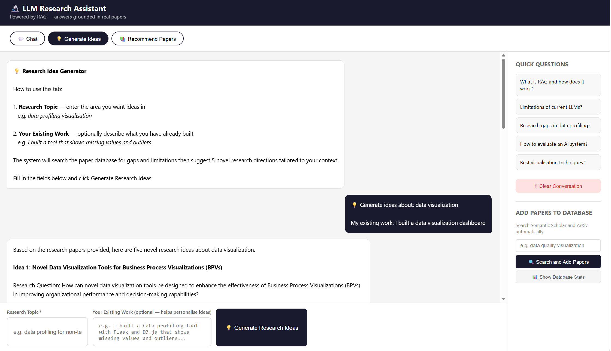
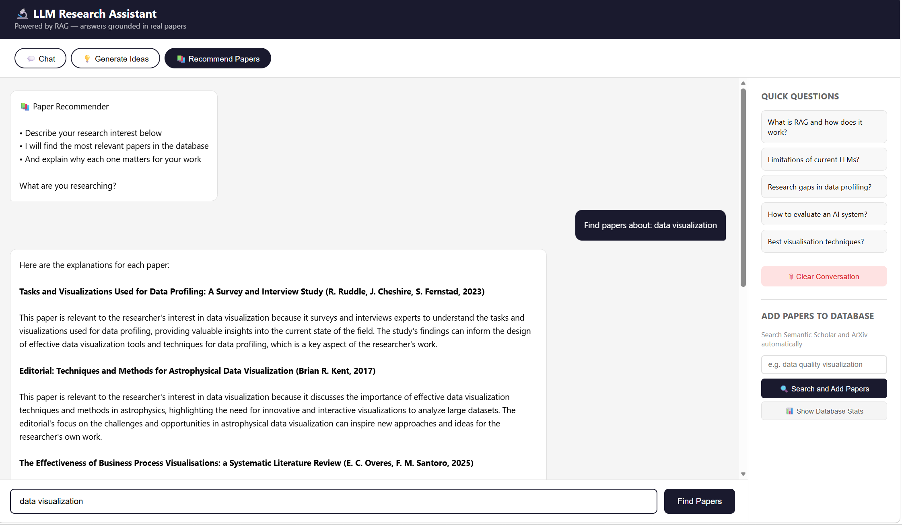

# LLM Research Assistant

A browser-based research assistant that uses 
Retrieval Augmented Generation (RAG) to help researchers 
discover literature, generate research ideas, and explore 
academic topics through natural language conversation.

---

## What It Does

Instead of asking a general AI that might make things up, 
this tool answers questions using **only real academic papers** 
from its database. Every answer includes citations showing 
exactly which papers the information came from.

The tool has three modes:

| Mode | What it does |
|---|---|
| 💬 Chat | Ask research questions and get cited answers from real papers |
| 💡 Generate Ideas | Enter a topic and get 5 novel research directions based on literature gaps |
| 📚 Recommend Papers | Describe your interest and get relevant papers with explanations |

---

## Screenshots

### Chat Mode — Grounded Answers with Citations


### Generate Ideas Mode
(Screenshots/generate_ideas_2.png)

### Recommend Papers Mode
(Screenshots/recommend_papers_2.png)

---

## How It Works

You type a question
↓
System converts your question to a vector (numbers representing meaning)
↓
ChromaDB finds the 5 most similar paper chunks in the database
↓
Those chunks are sent to Llama 3 on Hugging Face as context
↓
Llama 3 generates an answer using ONLY that context
↓
Answer appears with source citations


This approach is called RAG (Retrieval Augmented Generation).
It prevents hallucination because the model can only use 
retrieved content — it cannot make things up.

---

## Paper Database

The database is populated automatically from two free sources:

- **Semantic Scholar** — 200 million academic papers, free API
- **ArXiv** — latest CS and AI preprints, free API

Papers can be added through the sidebar search panel in the 
web interface — no manual downloading required.

---

## Tech Stack

| Component | Technology | Purpose |
|---|---|---|
| Backend | Flask (Python) | API routes and request handling |
| LLM | Llama 3 8B via Hugging Face | Answer generation (free tier) |
| Vector database | ChromaDB | Stores paper embeddings for search |
| Embeddings | Sentence Transformers | Converts text to searchable vectors |
| Paper sources | Semantic Scholar API, ArXiv API | Automatic paper fetching |
| Frontend | HTML, CSS, JavaScript | Chat interface |

---

---

## How to Run

### Prerequisites
- Python 3.8 or higher
- A free Hugging Face account and token

### Installation

```bash
# Clone the repository
git clone https://github.com/yourusername/llm-research-assistant.git
cd llm-research-assistant

# Install dependencies
pip install -r requirements.txt

# Create .env file with your Hugging Face token
echo "HF_TOKEN=hf_your_token_here" > .env

# Populate the paper database
python paper_fetcher.py

# Start the application
python app.py

# Open in browser
http://localhost:5000
```

---

## API Routes

| Route | Method | Description |
|---|---|---|
| `/` | GET | Renders main chat interface |
| `/chat` | POST | Handles research Q&A with RAG |
| `/ideas` | POST | Generates research ideas from literature |
| `/recommend` | POST | Recommends papers for a research interest |
| `/fetch_papers` | POST | Triggers paper search from Semantic Scholar and ArXiv |
| `/database_stats` | GET | Returns current paper count and sample titles |
| `/clear` | POST | Clears conversation history |

---


## Limitations and Future Work

**Current limitations:**
- Free Hugging Face tier has rate limits -- first request 
  after idle period takes 20 to 40 seconds while model loads
- Semantic Scholar and ArXiv APIs have rate limits -- 
  add papers gradually not all at once
- Database contains only abstracts from API sources -- 
  full paper text requires PDF upload

**Planned improvements:**
- Add experiment planning and automated code generation 
  (agentic AI -- Feature 3 from original specification)
- Improve paper relevance through better chunking strategy
- Add user authentication for multi-user deployment
- Add export functionality for generated ideas and recommendations
